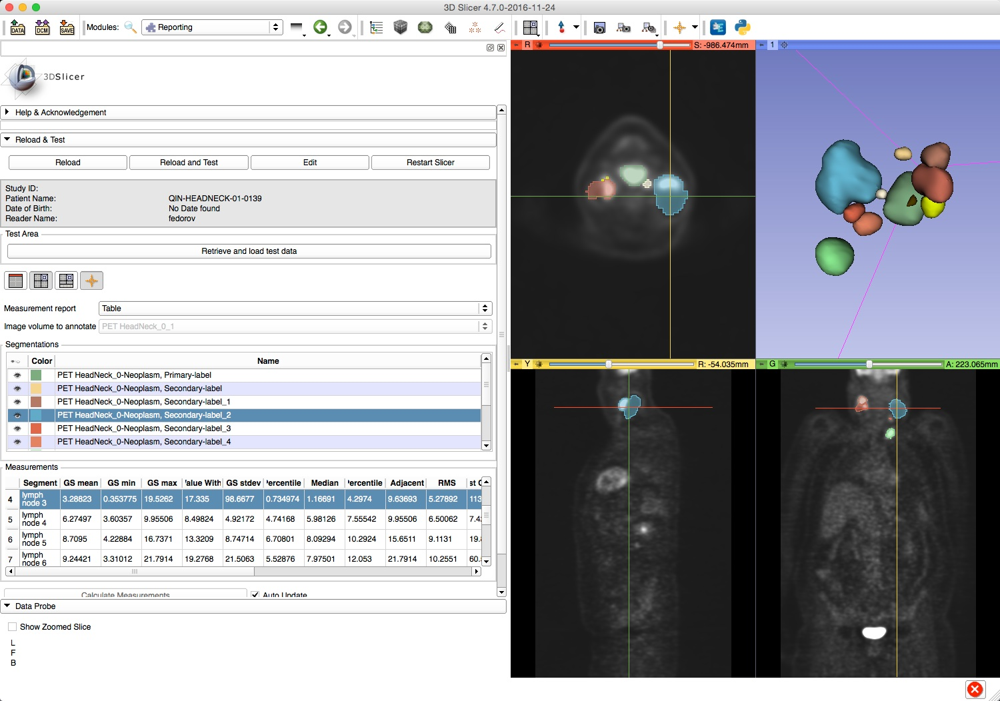

# Overview

Quantitative Reporting is an [3D Slicer](http://slicer.org) extension to support segmentation-based measurements with DICOM-based import and export of the results. The extension comes with a variety of plugins for loading DICOM Segmentations, Parametric Maps and Structured reports into Slicer.

## Capabilities of QuantitativeReporting include:

* load a DICOM image series (CT, MRI)
* support of quantitative analysis workflow 
* interactive image annotation (use automated segmentation tools of 3D Slicer to VOI)
* automatic calculation of VOI-based measurements
* save quantitative imaging results as a linked collection of DICOM objects: 
  * DICOM Structured Report [TID 1500](http://dicom.nema.org/medical/dicom/current/output/chtml/part16/chapter_A.html#sect_TID_1500) which references:
    * DICOM Segmentation 
* load and display the volumetric measurements stored using SR

### Support

Please feel free to contact us for questions, feedback, suggestions, bugs, or you can create issues in the issue tracker: [https://github.com/QIICR/QuantitativeReporting/issues](https://github.com/QIICR/QuantitativeReporting/issues)

* [Andrey Fedorov](https://github.com/fedorov) fedorov@bwh.harvard.edu

* [Christian Herz](https://github.com/che85) cherz@bwh.harvard.edu

### Acknowledgments

This work is supported in part the National Institutes of Health, National Cancer Institute, Informatics Technology for Cancer Research (ITCR) program, grant Quantitative Image Informatics for Cancer Research (QIICR) (U24 CA180918, PIs Kikinis and Fedorov).

### References

1. [Informatics Technology for Cancer Research (ITCR)](http://itcr.nci.nih.gov/)
2. [Quantitative Imaging Network (QIN)](http://imaging.cancer.gov/programsandresources/specializedinitiatives/qin)
3. Fedorov A, Clunie D, Ulrich E, Bauer C, Wahle A, Brown B, et al. DICOM for quantitative imaging biomarker development: a standards based approach to sharing clinical data and structured PET/CT analysis results in head and neck cancer research. PeerJ [Internet]. 2016;4:e2057. Available from: http://dx.doi.org/10.7717/peerj.2057
4. Sample data: [TCIA QIN-HEADNECK](https://wiki.cancerimagingarchive.net/display/Public/QIN-HEADNECK) collection

