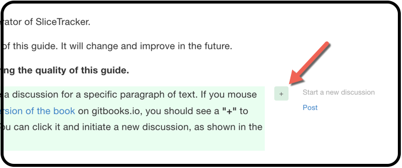

# User Guide

The following section is intended for the operator of QuantitativeReporting.

We are continuously working on the content of this guide. It will change and improve in the future.

**Your feedback is very important in improving the quality of this guide.**

To contribute your feedback, you can initiate a discussion for a specific paragraph of text. If you mouse over the paragraph while reading [the web version of the book](https://che85.gitbooks.io/quantitativereporting/content/) on gitbooks.io, you should see a **`+`** symbol to the right of the paragraph you are reading. You can click it and initiate a new discussion, as shown in the screenshot below. 

Once you post your feedback, developers of this guide will receive automatic notifications, and will respond to your suggestions or concerns.

Note that you will need to sign in before you can participate in a discussion (gitbook accepts Facebook, Twitter, Google and Github authentication).

