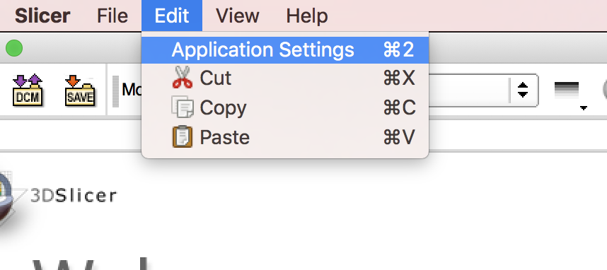
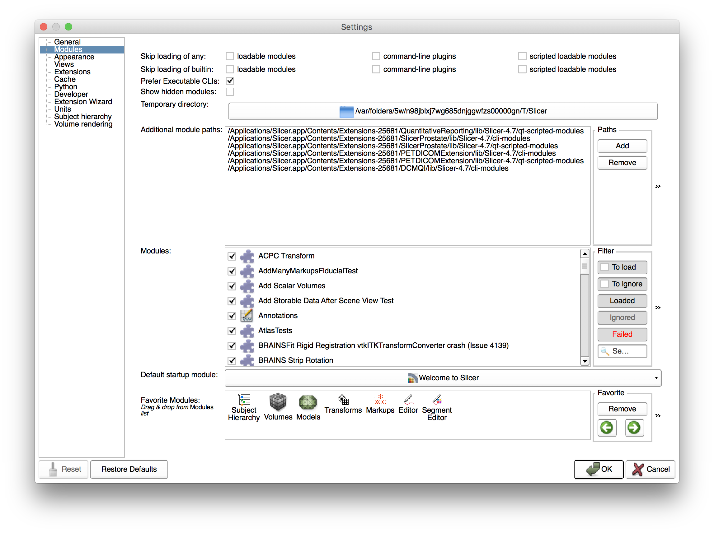
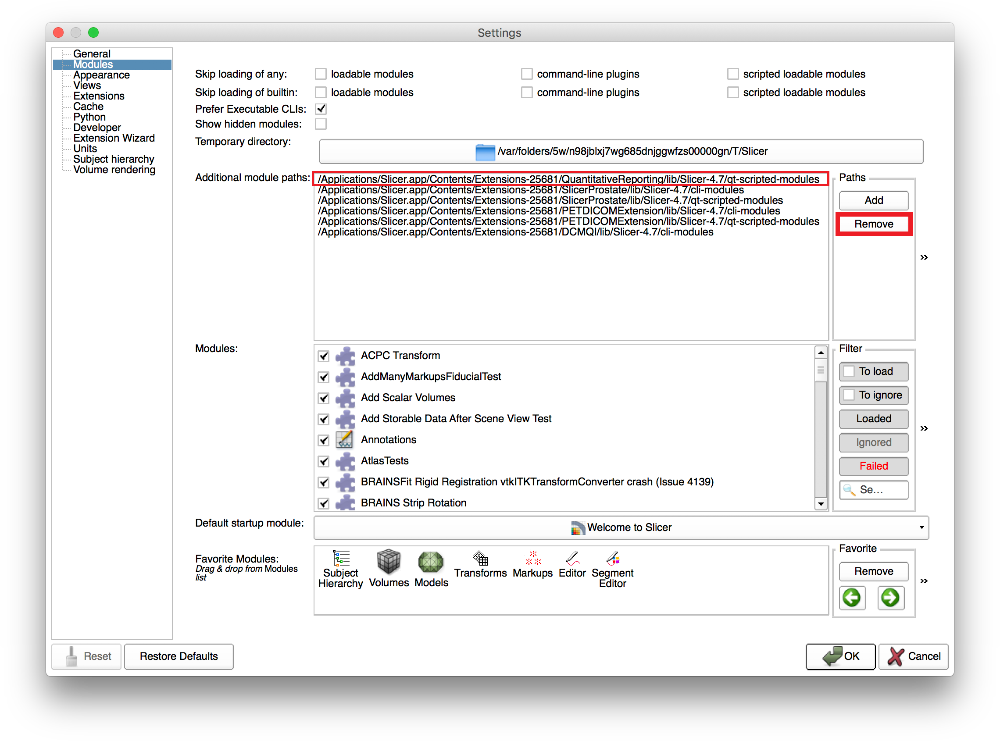
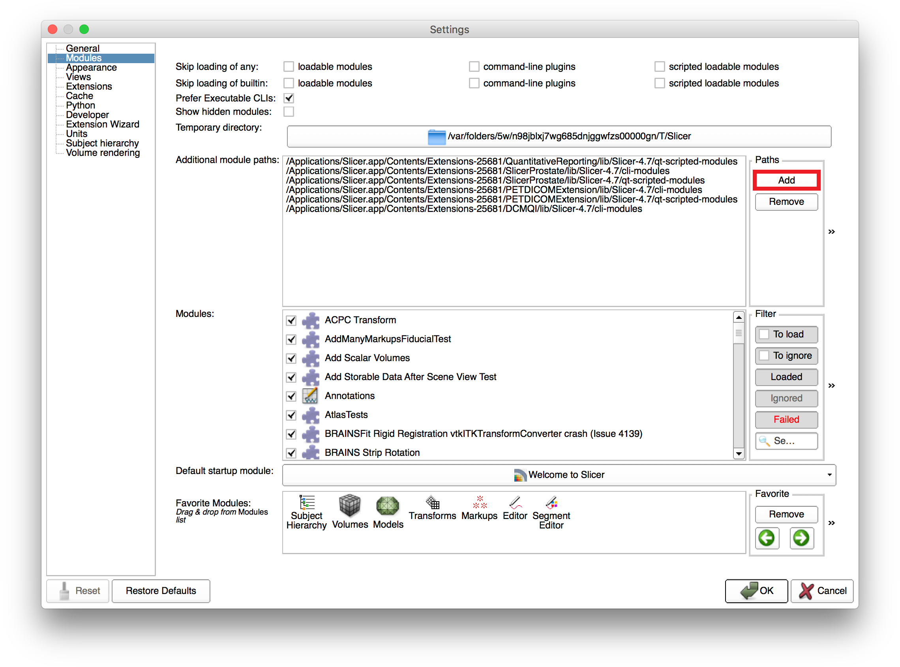

# QuantitativeReporting Slicelet

A Slicelet[^1] hides the complexity of Slicer's main application user interface. The user interface is limited to those components that are needed for accomplishing the main purpose of the module/extension for which this Slicelet was designed. In other words you can see it as a custom presentation of Slicer which can also reduce the Slicer package size by disabling major components that are not needed for the module.  


# Run Quantitative Reporting as a Slicelet

For now it's recommended to clone/download QuantitativeReporting manually from the [github repository] (https://github.com/QIICR/QuantitativeReporting.git). You can either go directly to the web interface and download it or use git[^2] and clone it by means of the cmd(Windows) or terminal(Linux/Mac). 

The following command clones the repository into a subdirectory "QuantitativeReporting" which will be located within the directory from where you executed this command:

```
git clone https://github.com/QIICR/QuantitativeReporting.git
```

**Note**: Make sure that you installed all dependencies needed by QuantitativeReporting. If you are using a recent nightly build of Slicer you could install QuantitativeReporting from the Extension Manager where all dependencies will get installed with it.

## Add Repository to Slicer Application Settings

In order to make your local QuantitativeReporting available in Slicer you will need to **add the subdirectory "Py"** to your Slicer application settings as described in the following subsections.

#### Go to "Edit" and Open "Application Settings":



#### Navigate to the Modules Settings:



#### Remove Unneeded QuantitativeReporting Module

In case that you installed a version of QuantitativeReporting with the aid of the Extension Manager, you will need to remove the paths which has been automatically added to the Slicer application settings. 

1. Look for a path that includes QuantitativeReporting in its name
2. Click onto the path that you would like to get removed from the list
3. Push button "Remove" for removing the selected path



#### Add Local QuantitativeReporting Module

The last step is to add your locally checked out/downloaded QuantitativeReporting to Slicer. Just click "Add" and navigate to the root directory of your local version. Furthermore you will need to select the subdirectory **"Py"** since this directory holds all important source files for the module.




## Mac OS X


## Windows

TODO

## Linux

TODO


[^1] Slicelet : https://www.slicer.org/wiki/Documentation/Nightly/Developers/Slicelets

[^2] git: https://git-scm.com/


