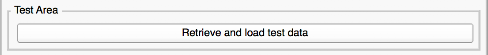
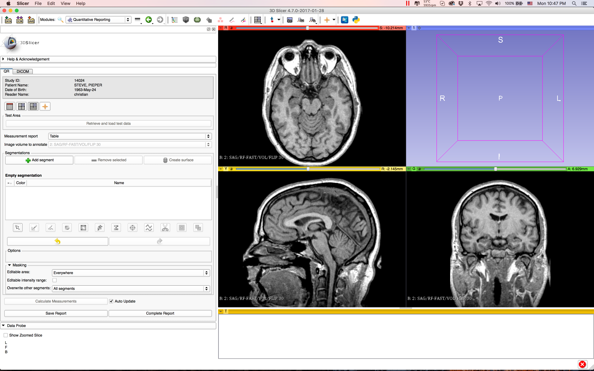
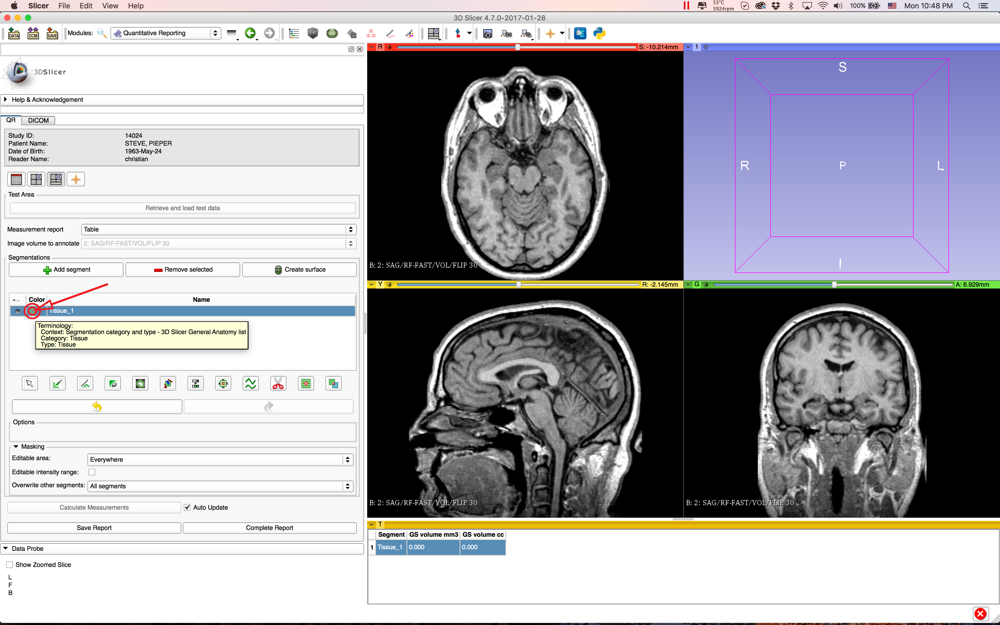
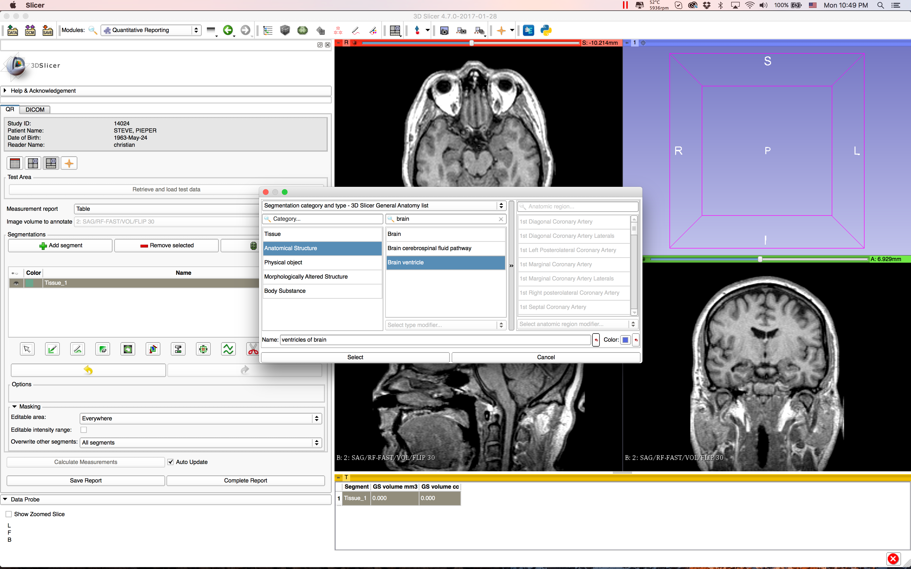
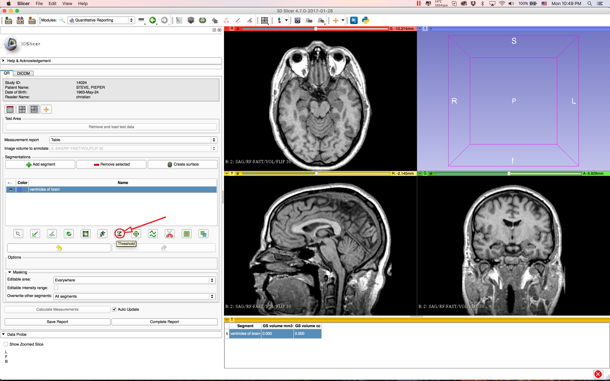
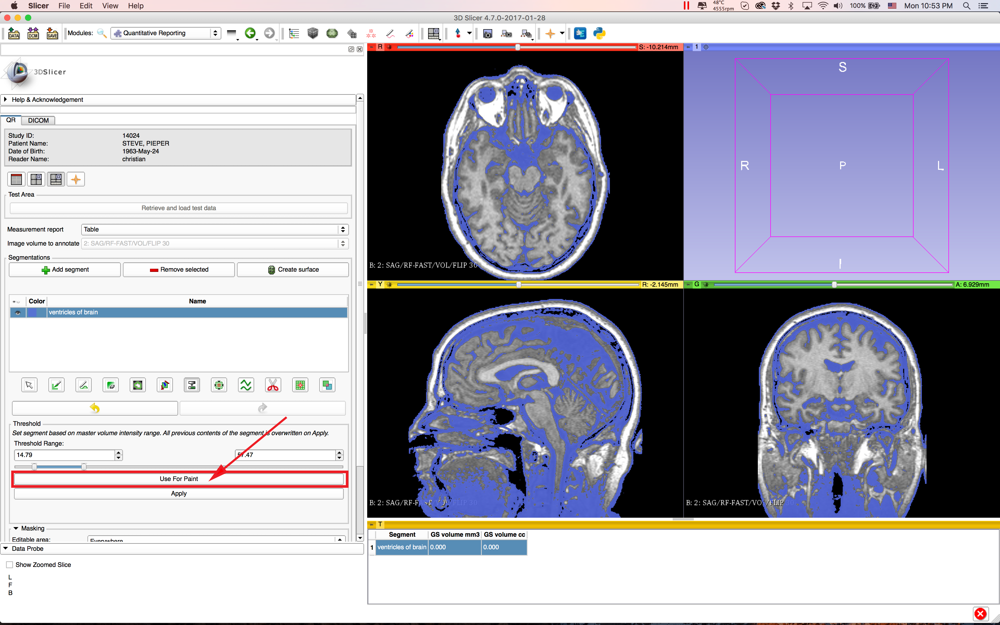
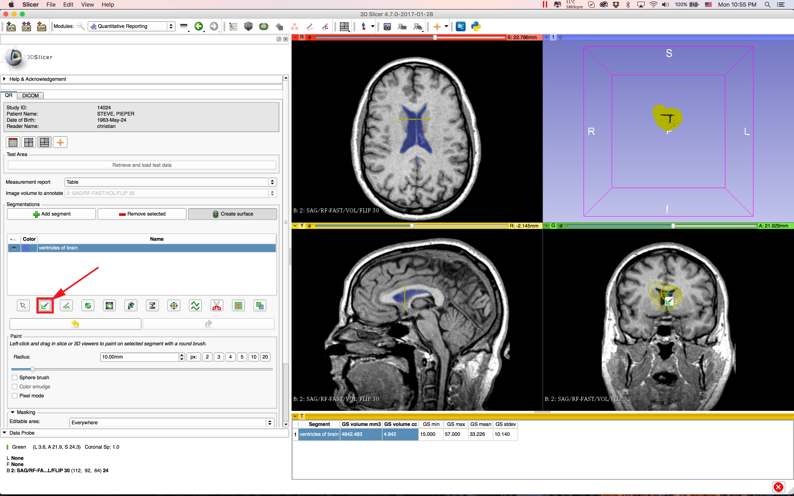
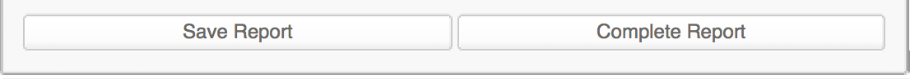

# Tutorial

This section describes in detail how to create a segmentation for a given DICOM sample dataset and save it in combination with automatically created volumetric measurements into the DICOM file format. The resulting data will be stored in the Slicer DICOM database and is therefore centrally accessible for later reading on this computer.

### Prerequisites

Make sure that you followed the instructions given in [Installation and upgrade](install.md)

## Create a DICOM Structured Report

In this section you will learn how to create a DICOM Structured Report which will include a DICOM Segmentation and volumetric measurements.

### Load DICOM Sample Dataset

First of all you will need to download a DICOM sample dataset. With using the button shown below this task will be performed for you.

This button will do the following for you: 

1. **Download** the DICOM sample dataset, 
2. **Unpacking** and **importing** it into 3D Slicer 
3. Initiating the **creation of a new measurement** table which references the downloaded DICOM sample dataset finally 
4. **Displays** it within your preferred slice view layout

### Create a Segmentation

Here you will get introduced to creating a segmentation.

#### Add Segment(s)

Once the DICOM sample dataset (or whichever dataset you would like to load into 3D Slicer) has been loaded into Quantitative Reporting you can go ahead and create a first segment. By hovering over the segments color icon a tooltip will appear which gives you more information about the currently assigned terminology of this segment. 

**Note**: Initially every segment is assigned to the terminology category and type **"Tissue"**.

#### Select Terminology

In order to make a segmentation more specific you can select another terminology by double clicking onto the color icon of the segment. This is shown in the previously displayed picture. The following screenshot shows the terminology selection widget.

#### Segment by Using Threshold and Paint Effect

### Save Report
Once you are done with creating a segmentation and you want to save the measurements result as DICOM, you can push one of the following buttons:

**"Save Report"**: Will create the **partially completed** DICOM Structured Report which could be continued at a later time (work in progress)

**"Complete Report"**: Will create the **completed** DICOM Structured Report representing the final version which usually wouldn't be modified afterwards.

## Load a DICOM Structured Report

This section will show you how to load a DICOM Structured Report from the Slicer DICOM database and how to load and display the results with Quantitative Reporting.

1. Open Slicer DICOM browser
2. Select the structured report that you want to load (modality:**SR**)
3. Select "Load" for loading the structured report into Slicer
4. Switch to module "QuantitativeReporting"
5. Select measurement report from dropdown: In case that you freshly restarted Slicer, you will just need to select the only available table from there. Otherwise select the last one.

With completing the previously shown steps, QuantitativeReporting should be ready to display the results.  

## Import a Custom DICOM Dataset into 3D Slicer and Load It

In case that you want to use your own dataset for running this tutorial, you will need to manually import it into 3D Slicer, load it and create a new measurement report in Quantitative Reporting. Depending on the size and speed of your internet connection this could take a few minutes. Once the DICOM dataset has been imported to 3D Slicer the other steps won't take much time.

**add screenshot here** of importing into Slicer

