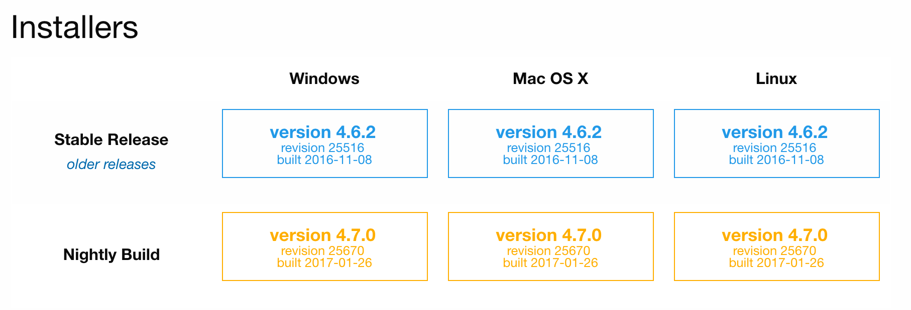

# Installation

SliceTracker should be available as an extension in the nightly version of 3D Slicer, starting Nov 24, 2016. We always suggest that you use the latest (nightly) version of the software when you try it for the first time.

Download the latest nightly release for your platform from http://download.slicer.org. 

**Do NOT use installers tagged as "Stable Release"!**

 

After downloading, follow the installation procedure for your platform. 

If you use Mac, make sure you move the Slicer application to the Applications folder on your computer before launching it!

Once installed, open Extension Manager by clicking the icon as shown below.

Search for "QuantitativeReporting" and install the extension by clicking the INSTALL button.

Note that QuantitativeReporting depends on several other extensions. When prompted, accept installation of those.

Once installation of QuantitativeReporting and dependencies is completed, you will need to restart Slicer application to access the module.

If installation was successful, you should be able to see QuantitativeReporting module in the Slicer module list.

# Upgrade
It is currently not possible to upgrade QuantitativeReporting without upgrading the 3D Slicer application.

If you need to upgrade the software, download the latest nightly release of 3D Slicer and install the QuantitativeReporting extension following [installation instructions](docs/user_guide/install.md).

