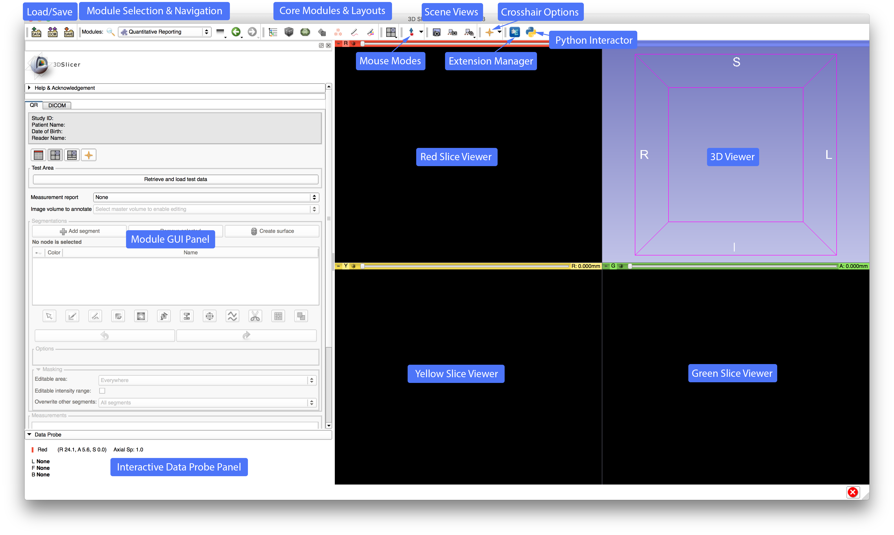

# User Interface Description

## 3D Slicer interface overview

Once SliceTracker is opened, note the purpose of the various components of the application interface.

For further information see [Slicer Documentation](https://www.slicer.org/wiki/Documentation/Nightly/SlicerApplication/MainApplicationGUI)

## QuantitativeReporting interface overview

UI components from top to bottom:

1. QuantitativeReporting is split into two tabs:
   1. The actually workspace which will be used in 90% of your workflow
   2. The Slicer DICOM Browser to make it better accessible within the QuantitativeReporting extension \(especially for the Slicelet version   **.... add reference here to "how to run as a Slicelet"**\)
2. Watchbox for displaying information about a\) the patient and b\) the reader
3. View settings area: here we added all currently supported Slicer viewer layouts and in addition to that a button for enabling/disabling the crosshair \(which can be very helpful when a segment is selected from the tables and you, the user needs to locate it within the viewers\)
4. Test Area: currently only with one button for downloading and displaying a DICOM sample dataset that can be used for trying the module
5. Selector area: 
   1. Measurement report: Create/select a new table for holding all the measurements created with this extension
   2. Image volume to annotate: Represents the master volume which will be used for creation of segmentations/volumetric measurements
6. Segmentations area: This are is supposed to help you creating segmentations from scratch. The here integrated widget is the Slicer SegmentEditor. It adds capabilities for: 
   1. add/remove segments:
   2. add terminology for each segment
   3. create surface from segmentations
   4. use a variety of tools \(so called effects\) that help you creating a segmentation \(i.e. thresholding, scissors\)
   5. and many more

For further information also see [Slicer Segment Editor](https://www.slicer.org/wiki/Documentation/Nightly/Modules/SegmentEditor)

1. Measurements area: Once you start creating segmentations by using the SegmentEditor, you will notice default measurements that will be displayed as the result of the SegmentStatistics module for each created segment within this table. You can either click onto a segment in the SegmentEditor or the measurements table which will cause all viewers to jump to the centroid of the selected segment \(as long as there is pixel data of the segment available\)

2. Calculate Measurements: You decide if you manually want to trigger the computation of the previously mentioned measurements or if it should be triggered automatically whenever a segment changes \(pixel data, name, terminology\)

3. Report buttons: you can either save a report and continue later \(needs to be implemented\) or complete the current report. Either way a DICOM Structured Report with a referenced DICOM Segmentation will be created and pushed into the Slicer DICOM database.

