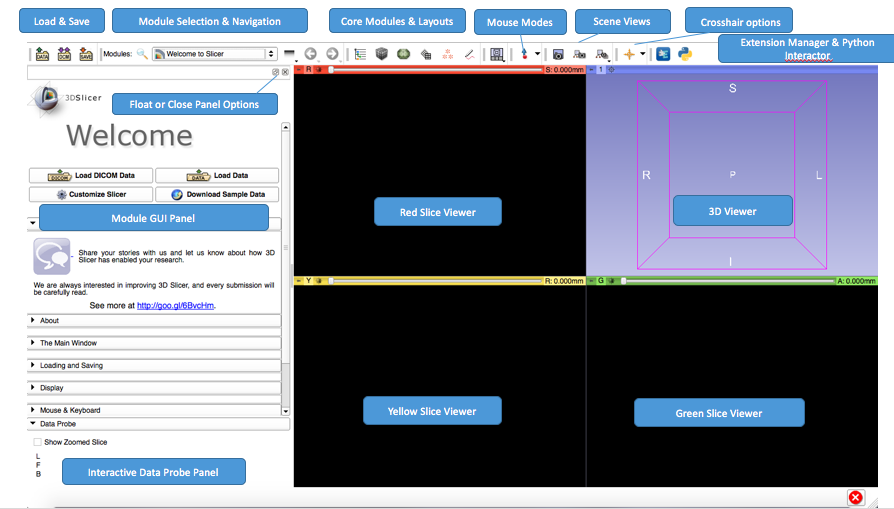

# User Interface Description

## 3D Slicer interface overview

Once SliceTracker is opened, note the purpose of the various components of the application interface.

For further information see [Slicer Documentation](https://www.slicer.org/wiki/Documentation/Nightly/SlicerApplication/MainApplicationGUI)

## QuantitativeReporting interface overview

UI components from top to bottom:

1. QuantitativeReporting is split into two tabs:
   1. The actually workspace which will be used in 90% of your workflow
   2. The Slicer DICOM Browser to make it better accessible within the QuantitativeReporting extension \(especially for the Slicelet version   **.... add reference here to "how to run as a Slicelet"**\)
2. Watchbox for displaying information about a\) the patient and b\) the reader
3. View settings area: here we added all currently supported Slicer viewer layouts and in addition to that a button for enabling/disabling the crosshair \(which can be very helpful when a segment is selected from the tables and you, the user needs to locate it within the viewers\)
4. 

